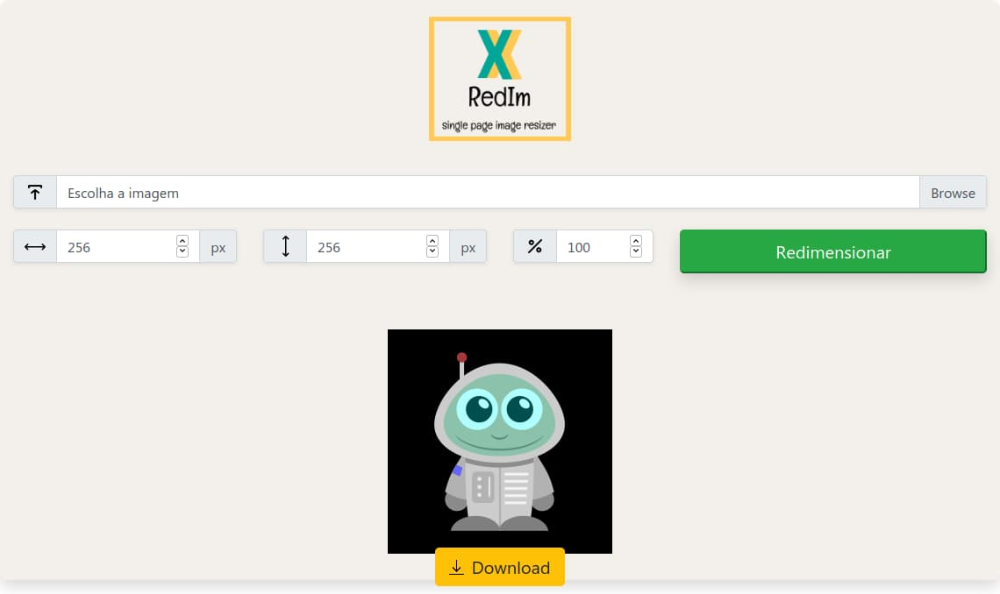

# RedIm: single page image resizer

Redimensionador de imagens (JPEG e PNG) simples e rápido, tudo em uma só página. Feito utilizando PHP, JavaScript, Bootstrap e um pouco de matemática. Acesse em http://redim.epizy.com/.

## Como usar

<ol>
  <li>Escolha a imagem no seu computador que deseja redimensionar;</li>
  <li>Escolha os novos valores de altura/largura ou porcentagem em relação ao tamanho original da imagem;</li>
  <li>Ao clicar no botão "Redimensionar" as alterações serão feitas, a será imagem redimensionada e você poderá baixá-la.</li>
</ol>

## Features futuras

- [x] Redimensionamento por porcentagem.
- [ ] Suporte a redimensionamento de GIFs.

